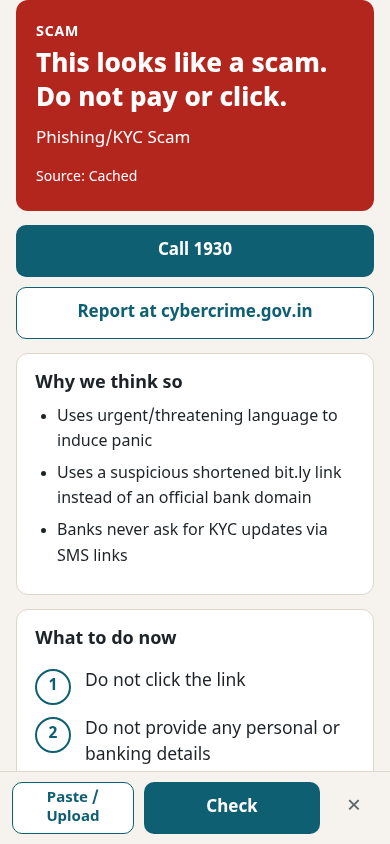
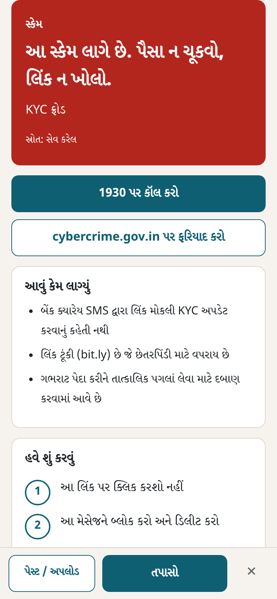
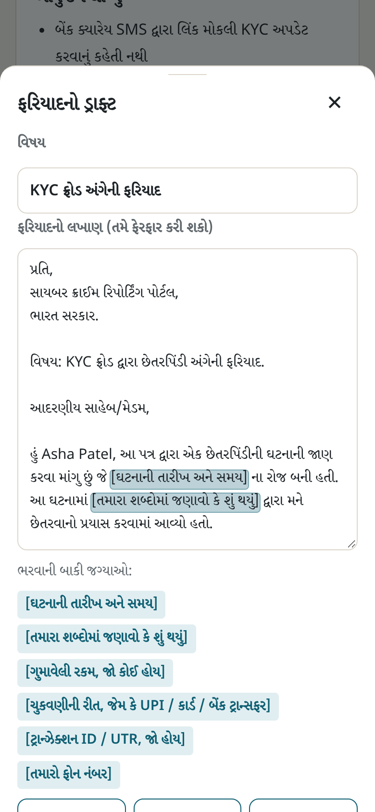
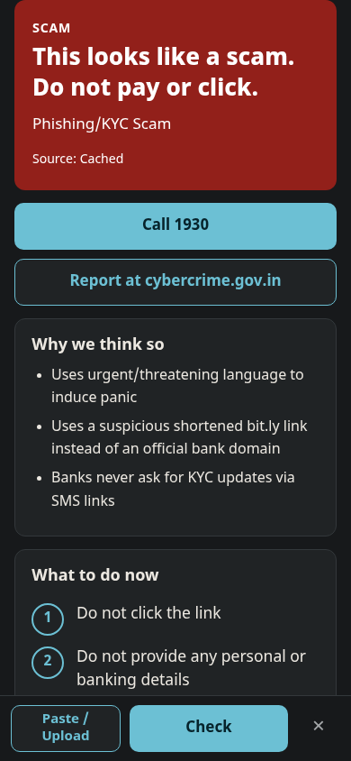
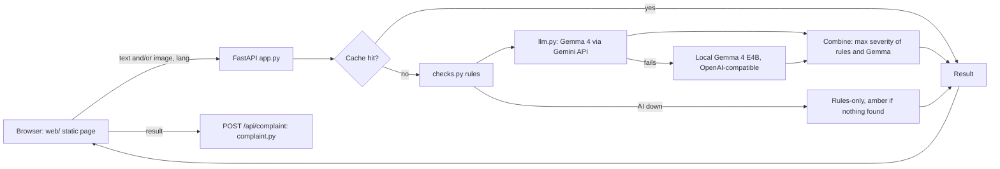

# Thagi Pakdo (ઠગી પકડો)

[](https://github.com/Neelk1812/thagi-pakdo/actions/workflows/test.yml)
[](LICENSE)

**Paste a suspicious SMS, WhatsApp or UPI message, or upload a screenshot, and get a plain verdict (red / amber / green), the reasons, what to do next, and a ready-to-file cybercrime complaint, in Gujarati, Hindi or English.** Built for Hack Day Surat with Gemma 4.

**Live demo: https://thagi-pakdo.vercel.app** (shared free-tier Gemini key; see [Limits](#honest-limits))

<p align="center"></p>

| Gujarati result | Complaint draft | Dark mode |
|---|---|---|
|  |  |  |

## Try it in 60 seconds

1. Open the live demo (or run it locally, below).
2. Tap **Fake KYC SMS**: you get a red card, three reasons and numbered steps. The five sample buttons are fake messages and answer instantly from a committed cache.
3. Paste your own made-up scam text (for example "Your bank account will be blocked today, update KYC at http://bit.ly/x") and tap **Check**. This is a live Gemma call (about 2 to 5 s).
4. Tap **ગુજરાતી** or **हिन्दी** to see the same answer in that language, then **Read aloud**.
5. Tap **Draft a complaint** to get a formal complaint for [cybercrime.gov.in](https://cybercrime.gov.in). Anything you don't fill in stays a visible `[placeholder]`; nothing is invented.
6. Tap **Safe bank OTP**: a genuine OTP alert with no link and no ask is green ("This looks safe, but stay alert.").

## Quick start

```bash
git clone https://github.com/Neelk1812/thagi-pakdo && cd thagi-pakdo
pip install -r requirements.txt
cp .env.example .env   # add GEMINI_API_KEY, then: uvicorn app:app
```

Open http://127.0.0.1:8000. Python 3.13 is what we developed on; CI also runs 3.12. Without a key the sample buttons still work from cache and other inputs fall back to rules-only. To try it from a phone on the same Wi-Fi, use `uvicorn app:app --host 0.0.0.0` and open `http://<computer-ip>:8000` (plain HTTP on your LAN; not tested on a real phone).

## How Gemma is used

- **Model:** `gemma-4-26b-a4b-it` (override with `GEMINI_MODEL`) through the `google-genai` SDK. Gemma reads the message or screenshot and writes the verdict, reasons and advice **in the user's language**.
- **Screenshots:** the image is downscaled to at most 1024 px (JPEG) and sent **before** the text prompt. If the inline call fails for a non-transient reason, it retries through the Files API.
- **Strict JSON:** the prompt asks for one JSON object (`verdict`, `scam_type`, `reasons`, `red_flags_found`, `extracted`, `advice`). Output is parsed defensively (code fences and thinking blocks stripped, first balanced object taken, fields normalised). Temperature is 0.1 and thinking is set to minimal, which brought a call from tens of seconds to about 3 to 5 s on this model.
- **Rules plus AI:** `checks.py` is plain code with no model. It extracts URLs, UPI IDs, phone numbers and amounts and flags shorteners, lookalike and punycode domains, risky endings (.xyz, .top ...), `http://`, urgency, KYC, OTP/PIN asks, UPI collect requests, fake prizes, courier fees, remote-access apps, "digital arrest" and similar patterns. A message that only warns "never share your OTP" is not flagged. The final verdict is the **more severe** of the rules and Gemma, so a strong rule hit can never be turned green by the model.
- **Fallbacks:** if Gemini fails (rate limit, timeout, network), the app tries a local **Gemma 4 E4B** behind an OpenAI-compatible endpoint (`LLM_BACKEND`, `LOCAL_BASE_URL`, `LOCAL_MODEL`). If that also fails, you get a rules-only verdict marked "AI unavailable".
- **Fail-open to amber:** if the AI could not run **and** the rules found nothing, the result is **amber** ("We couldn't fully check this message"), never green, and it is not cached. The point is that an outage must never present an unchecked message as "looks safe". Covered by `test_fail_open_*` in `tests/test_app.py` (localized wording, never cached, image-only input, code-red and AI-green still honoured, failure on a user-supplied key).
- **Cache:** results are cached by the exact input (image bytes and/or text, plus language). The five fake samples and their complaint drafts are committed in `sample_cache/`, so they work with no key or internet.
- **Complaints:** `complaint.py` asks Gemma for a draft from the check result and your optional details, with a deterministic offline template as fallback. Your details are not cached or logged.

## Architecture



## Honest limits

- **Shared free-tier key on the live demo.** Heavy use may hit rate limits. The app also limits each IP to 20 checks and 10 complaint drafts per minute (cached and sample answers are not counted) and rejects uploads over 4 MB. A limited or failed call falls back to rules-only or amber.
- **Privacy.** On the free Gemini tier, Google may use what you send to improve its products. The demo is for **fake samples only**; for real messages run locally with `LLM_BACKEND=local`.
- **Unverified:** a real Gemma 4 E4B run (the local path was tested only against a stub OpenAI-compatible server and unit tests); Google sign-in with a real account; use on a real phone; read-aloud voices on devices other than the ones we tried (the button hides itself if there is no voice); the Docker image.
- **Not a guarantee.** Green means no known warning signs were found. The complaint is a draft you must read and file yourself. If money is lost, call **1930** immediately.
- **Measured** (3 Oct 2026, clean clone): cached answers about 10 ms locally; live check about 2 to 5 s; live complaint about 8 to 12 s; the live site adds network time.

## Tests and CI

`pytest` runs 196 tests with a mocked model, a temporary cache and no API key (verified with the key unset). GitHub Actions runs them on push for Python 3.12 and 3.13 (`.github/workflows/test.yml`).

## Reference

<details><summary>Configuration (environment variables / <code>.env</code>)</summary>

`app.py` has a small built-in `.env` loader (no python-dotenv); real environment variables win over `.env`.

| Variable | Default | Meaning |
|---|---|---|
| `GEMINI_API_KEY` | none | Google AI Studio key |
| `GEMINI_MODEL` | `gemma-4-26b-a4b-it` | Hosted model |
| `LLM_BACKEND` | `gemini` | `gemini` (fail over to local) or `local` (local only) |
| `LOCAL_BASE_URL` | `http://localhost:11434/v1` | Ollama / llama.cpp OpenAI-compatible endpoint |
| `LOCAL_MODEL` | `gemma4:e4b` | Local model name (leave unset for the default) |
| `GOOGLE_CLIENT_ID` | unset | Turns on optional Google sign-in + bring-your-own-key ([AUTH.md](AUTH.md)); off by default |
| `RATE_LIMIT_CHECK` / `RATE_LIMIT_COMPLAINT` | `20` / `10` | Per-IP requests per minute |
| `CACHE_DIR` | `sample_cache/` | Cache location |

Local mode: `ollama pull gemma4:e4b` (check the exact tag on your Ollama), then `LLM_BACKEND=local uvicorn app:app`.
</details>

<details><summary>API</summary>

| Endpoint | What it does |
|---|---|
| `POST /api/check` | multipart: optional `image`, optional `text`, `lang=gu\|hi\|en`; returns verdict JSON |
| `POST /api/complaint` | JSON `{result, lang, details?}`; returns `{subject, body, portal_url, helpline, missing_fields, source}` |
| `GET /api/config` | `{auth_required, google_client_id}` |
| `GET /api/health` | backend, model, whether a key is set |
</details>

<details><summary>Deploy (Vercel, Docker)</summary>

**Vercel:** `scripts/make_vercel.sh` builds a deployable copy (default `/workspace/vercel_build`; pass another path). Then `cd` into it, `vercel link`, `vercel env add GEMINI_API_KEY`, `vercel deploy --prod`. The filesystem is read-only there, so new results are simply not cached.

**Docker:** `docker build -t thagi-pakdo . && docker run --rm -p 7860:7860 -e GEMINI_API_KEY=your-key thagi-pakdo` (unverified: not built or run by QA). `scripts/make_space.sh` assembles the same files for a Docker-based Hugging Face Space (also unverified).
</details>

<details><summary>Project layout</summary>

```
app.py            FastAPI app: /api/check, /api/complaint, /api/config, /api/health; serves web/ and /samples
checks.py         Rule-based scam checks and severity scoring (no AI)
llm.py            Gemma backends (Gemini API, local), JSON parsing, failover
complaint.py      Complaint drafting (AI draft + offline template)
auth.py, AUTH.md  Optional Google sign-in and bring-your-own-key
web/              Static front end (no build step)
samples/          Fake sample messages (.txt) and screenshots (.png)
sample_cache/     Cached results for the fake samples and their complaint drafts
skills/scam-check/  Agent Skill (SKILL.md + scripts/check.py)
scripts/          prewarm.py, make_vercel.sh, make_space.sh
tests/            pytest suite
docs/screens/v2/  Screenshots used above
```
</details>

<details><summary>Agent Skill</summary>

`skills/scam-check/` follows the [Agent Skills](https://agentskills.io) spec and validates with `agentskills validate skills/scam-check` (from `pip install skills-ref`).

```bash
python skills/scam-check/scripts/check.py --file samples/kyc_sms.txt
```

It prints JSON (`verdict`, `score`, `reasons`, `extracted`, `advice`) from the offline rules only and exits 0 / 1 / 2 for green / amber / red.
</details>

## What's original, and AI assistance

All code, UI, fake samples and the Agent Skill were written during the event: the rule-based checks tuned to Indian fraud patterns, the max-severity combination, the failover and fail-open behaviour, the cache, complaint drafting, the optional sign-in layer and the Gujarati / Hindi / English mobile-first front end. Third-party: FastAPI, uvicorn, python-multipart, httpx, Pillow, requests, google-auth, google-genai and pytest; the Gemma 4 models are used under Google's terms. The optional sign-in page loads Google Identity Services.

Built with AI coding agents (Grok Bot agents) during the event, which helped plan, write and test the code and docs. Gemma 4 is also used at run time to analyse messages.

## License

Apache License 2.0. See [LICENSE](LICENSE).
