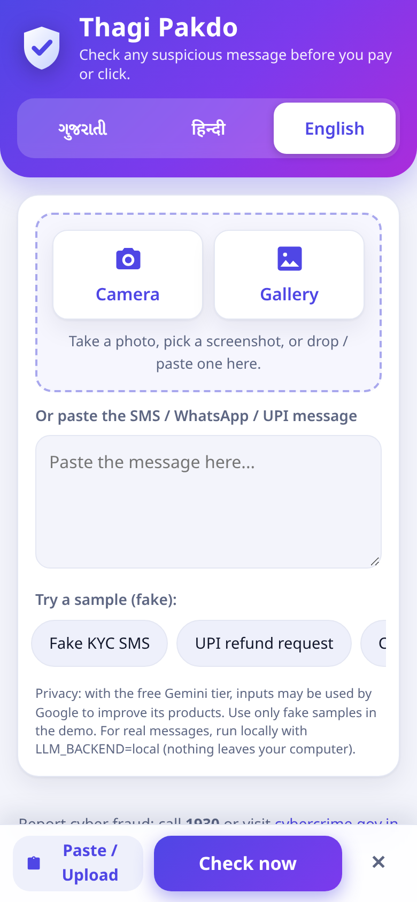
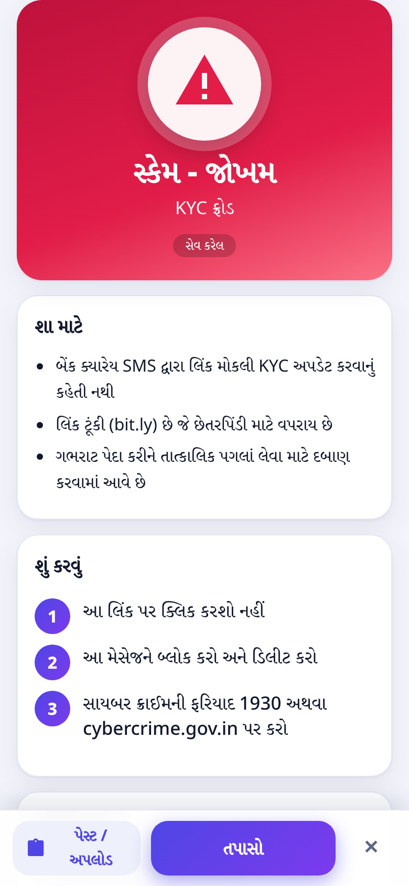
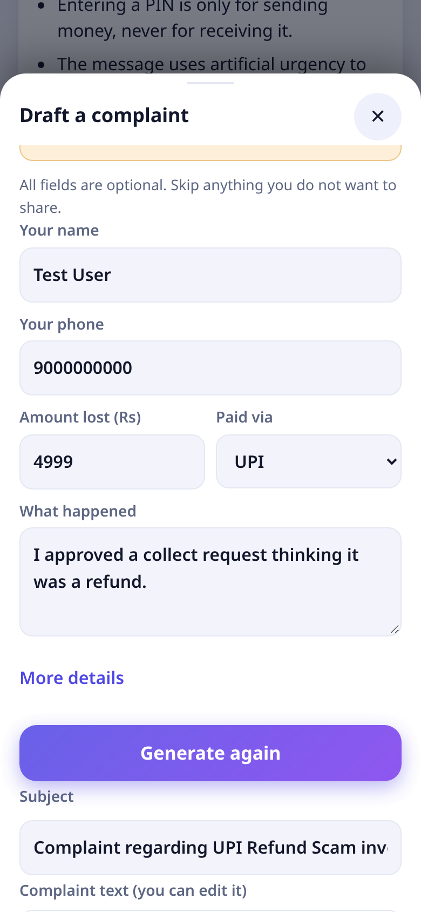
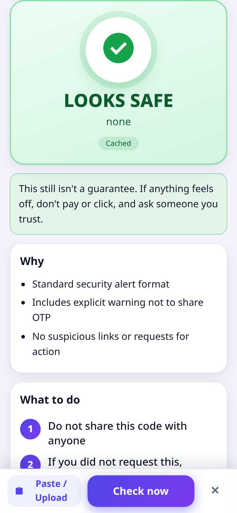

# Thagi Pakdo (ઠગી પકડો) - Scam Checker

Paste a suspicious SMS / WhatsApp / UPI message, or upload a screenshot of it, and get a big **RED / AMBER / GREEN** verdict, 2 to 4 plain-language reasons, and "what to do" steps (don't pay, don't click, block, report to **1930** / [cybercrime.gov.in](https://cybercrime.gov.in)). It works in **Gujarati, Hindi and English**, can **read the answer aloud**, and can **draft the cybercrime-portal complaint** for you.

Built for Hack Day Surat. "Thagi Pakdo" means "catch the con".

| Home | Scam result (Gujarati) | Complaint draft | Safe message |
|---|---|---|---|
|  |  |  |  |

More screenshots (phone, tablet, laptop) are in [`docs/screens/`](docs/screens/).

## Features

- **Three languages**: Gujarati, Hindi, English, switchable at any time; the AI answer is written in the chosen language.
- **Screenshot or text**: camera, gallery, drag-drop, paste, or type. Five fake one-tap samples (four scams, one safe).
- **Rules plus AI**: plain-code checks (shortened/lookalike links, bad domain endings, urgency, fake KYC, OTP/PIN asks, UPI collect requests, fake prizes, courier fees) combined with a Gemma verdict. The final verdict is the more severe of the two, so the AI can never talk a strong rule hit down to green.
- **Read-aloud** using the browser's speech voices; the button is hidden if the device has no voice for the language.
- **Complaint drafting**: turns a result into a formal complaint for [cybercrime.gov.in](https://cybercrime.gov.in). Everything about you is optional; anything you don't give stays a visible `[placeholder]` and is never invented. Details you type are not cached or logged.
- **Offline / rules fallback**: if Gemini is unreachable or rate-limited it fails over to a local Gemma server; if that is also down you still get a rules-only verdict marked "AI unavailable". Already-checked inputs are served from `sample_cache/`.
- **Mobile-first** layout (checked at 390 px wide) with an installable web-app manifest.
- **Optional Google sign-in with bring-your-own Gemini key** for hosts who don't want to pay for everyone's calls. **Off by default**; see [AUTH.md](AUTH.md).

## How it works

1. **Plain-code checks (`checks.py`)** - no AI. Extracts URLs, UPI IDs, phone numbers and amounts and scores the warning signs.
2. **Gemma (`llm.py`)** - reads the message or screenshot and returns strict JSON (verdict, scam type, reasons, advice) in the chosen language.
3. **Combine (`app.py`)** - final verdict = the more severe of the rules and Gemma.
4. **Complaint (`complaint.py`)** - AI draft with a deterministic offline template as fallback.

## Run it

Developed and tested with Python 3.13 (other versions untested).

```bash
git clone https://github.com/Neelk1812/thagi-pakdo && cd thagi-pakdo
python -m venv venv && source venv/bin/activate
pip install -r requirements.txt
cp .env.example .env                # then put your GEMINI_API_KEY in .env
uvicorn app:app
```

Open http://127.0.0.1:8000.

**On your phone (same Wi-Fi):** start the server with `uvicorn app:app --host 0.0.0.0`, find your computer's local IP address, and open `http://<that-ip>:8000` on the phone. This serves plain HTTP on your LAN, so only use it on a network you trust; some phone features (such as the camera or install-as-app) may be restricted on non-HTTPS pages **[not tested on a real phone]**.

Without a Gemini key the app still runs: cached samples are served from `sample_cache/`, and anything else falls back to a local Gemma server (if configured) or to the rules-only verdict marked "AI unavailable".

### Live demo

**https://thagi-pakdo.vercel.app** - a hosted copy of this repo. It uses a **shared free-tier Gemini key**, so heavy use may be rate limited (a limited call falls back to the rules-only verdict, marked "AI unavailable"). The 5 sample buttons are **instant from the committed cache** and don't use the key at all. Expect roughly 2.5 to 8 s for a new (uncached) check and 7 to 14 s for a live complaint draft; cached answers are instant. The team saw no 429 rate-limit errors with 12 concurrent requests **[load test run by the Backend agent, not re-run by QA]**.

The privacy note applies to the hosted demo: with the free Gemini tier, inputs may be used by Google to improve its products, so try only the fake samples or made-up messages. The repo is meant to be run locally for real messages (`LLM_BACKEND=local`), and the live link may go offline at any time.

## Deploy

### Deploy to Vercel

`scripts/make_vercel.sh` builds a deployable copy of the app in `/workspace/vercel_build` (pass another folder as the first argument). It does not deploy anything. The copy contains the Python backend as a Vercel function (`api/index.py` wrapping `app.py`, renamed `thagi_app.py`), the `web/` files as static `public/`, the `samples/`, only the cache entries for the 5 fake samples plus the complaint drafts, a slimmed `requirements.txt` (no pytest/uvicorn), `vercel.json` (60 s max duration) and `.python-version` 3.13.

```bash
npm i -g vercel                      # once
scripts/make_vercel.sh               # builds /workspace/vercel_build (or give your own path)
cd /workspace/vercel_build           # or the path you gave
vercel link                          # once, to pick the project
vercel env add GEMINI_API_KEY        # set it as a Vercel environment variable, never in a file
vercel deploy --prod
```

Optionally also set `GOOGLE_CLIENT_ID` to turn on [sign-in](AUTH.md). On Vercel the filesystem is read-only, so new results are simply not cached (a warning is logged and the answer is still returned).

### Docker

The `Dockerfile` (Python 3.13 slim, runs as a non-root user, listens on `$PORT`, default 7860) installs the runtime dependencies and copies the app, `web/`, `samples/`, `sample_cache/` and `skills/`. No `.env` goes into the image; pass the key at run time:

```bash
docker build -t thagi-pakdo .
docker run --rm -p 7860:7860 -e GEMINI_API_KEY=your-key thagi-pakdo
```

Then open http://localhost:7860. **[The Docker image was not built or run by QA - unverified.]** `scripts/make_space.sh` assembles the same files for a Docker-based Hugging Face Space; that path is also unverified.

### Configuration (environment variables / `.env`)

Copy `.env.example` to `.env` and fill it in (`.env` is git-ignored; never commit keys). `app.py` has a small built-in `.env` loader (no python-dotenv needed) that runs at startup. Variables already set in your real environment take priority over `.env`. Lines are `KEY=VALUE`; `#` comments are allowed.

| Variable | Default | Meaning |
|---|---|---|
| `GEMINI_API_KEY` | none | Google AI Studio key for the hosted Gemma model |
| `GEMINI_MODEL` | `gemma-4-26b-a4b-it` | Hosted model name |
| `LLM_BACKEND` | `gemini` | `gemini` = Gemini first, fail over to local; `local` = local only |
| `LOCAL_BASE_URL` | `http://localhost:11434/v1` | OpenAI-compatible endpoint (Ollama or llama.cpp server) |
| `LOCAL_MODEL` | `gemma4:e4b` | Model name served locally (leave unset to use the default) |
| `LOCAL_API_KEY` | `local` | Bearer token sent to the local server (usually ignored) |
| `GEMINI_TIMEOUT_MS` / `LOCAL_TIMEOUT` | `30000` / `120` | Timeouts |
| `GOOGLE_CLIENT_ID` | unset | Setting this turns on Google sign-in + bring-your-own-key (see below) |
| `CACHE_DIR` | `sample_cache/` | Where cached results are stored |

### Local mode (real messages stay on your machine)

Run Gemma 4 E4B behind an OpenAI-compatible server, then point the app at it:

```bash
# Ollama (default port 11434)
ollama pull gemma4:e4b          # [unverified] check the exact model tag on your Ollama
# or llama.cpp: llama-server -m <gemma-4-e4b.gguf> --port 8080

LLM_BACKEND=local LOCAL_BASE_URL=http://localhost:11434/v1 LOCAL_MODEL=gemma4:e4b uvicorn app:app
```

Local mode is selected with `LLM_BACKEND=local`. It has **not been tested with a real Gemma 4 E4B model [unverified]**; the local code path was only checked against a stub OpenAI-compatible server and unit tests.

### Optional: Google sign-in and your own Gemini key

Off by default. If you set `GOOGLE_CLIENT_ID` (a Google OAuth *web* client ID), then any request that needs a **new** Gemini call (a cache miss) must carry a Google ID token (`Authorization: Bearer ...`) and the user's own key (`X-Gemini-Key`). Cached results and the sample buttons stay open. The server's own key is not used in this mode. Full details and error codes are in [AUTH.md](AUTH.md).

> **Sign-in & your own Gemini key (optional).** When the host enables Google sign-in, new (uncached) checks need you to sign in with Google and paste your own free Gemini API key from aistudio.google.com/apikey. Your key is sent with each request, used only for that request, and is never stored, cached or logged by this server. Your Google ID token is only used to confirm who you are. The sample buttons always work without signing in.

## API

| Endpoint | What it does |
|---|---|
| `POST /api/check` | multipart form: optional `image`, optional `text`, `lang=gu\|hi\|en`; returns the verdict JSON |
| `POST /api/complaint` | JSON `{result, lang, details?}` where `result` is an `/api/check` response; returns `{subject, body, portal_url, helpline, missing_fields, source}` |
| `GET /api/config` | `{auth_required, google_client_id}` |
| `GET /api/health` | which backend and model are configured, and whether a key is present |
| `GET /` | the web app (`web/`); `/samples/*` serves the fake samples |

## Speed and test status

Re-measured on 3 Oct 2026 from a clean clone running locally of this repo (server and client on the same machine; hosted Gemma over the internet):

| Case | Time |
|---|---|
| Cached result (same image/text + language) | about 10 ms (roughly 4 to 30 ms) |
| Live Gemma call, text only | about 2 to 4 s |
| Live Gemma call, screenshot | about 3.8 to 5.3 s |
| Live complaint draft | about 7.5 to 9 s |
| Cached complaint draft | about 13 ms |
| Gemini unreachable or bad key, rules-only answer | under 0.5 s |

The cache key is the exact input (image bytes and/or text) plus the language, so edited text or a different screenshot is a live call. The committed cache covers the five fake samples in en, hi and gu.

Verified from a clean clone: the 83 unit tests pass; all 5 samples give the right verdict (4 scams red, the safe OTP green) in en, hi and gu; image upload; live checks in all three languages; complaint drafting (live and offline template); a bad Gemini key and a dead local server both fall back to the rules-only verdict; failover to a local OpenAI-compatible endpoint (stub server); sign-in is off by default and returns clean 401 errors when switched on; the page has no horizontal scroll at 390 px wide. **Not verified:** a real Gemma 4 E4B local model, the Google sign-in flow with a real Google account, running on a real phone, and read-aloud voices on other devices.

## Privacy

- With the **free Gemini tier, Google may use inputs to improve its products.** Do not paste real personal messages while using the hosted model.
- The demo uses **only fake samples** (`samples/`).
- For real messages, run locally with `LLM_BACKEND=local` so nothing leaves your machine.
- The app stores nothing except cached results for already-checked inputs in `sample_cache/`. Complaint details you type (name, phone, amounts) are not cached or logged. The cache committed in this repo was generated from the fake samples only; your own checks will add files there, so don't commit them.

## Agent Skill

`skills/scam-check/` is an [Agent Skills](https://agentskills.io) skill so any compatible AI agent can run the same checks.

```bash
python skills/scam-check/scripts/check.py "Your SBI account will be blocked today. Update KYC: http://bit.ly/abc"
python skills/scam-check/scripts/check.py --file samples/kyc_sms.txt
```

It prints JSON (`verdict`, `score`, `reasons`, `extracted`, `advice`) and exits 0 / 1 / 2 for green / amber / red. It is offline and rule-based only. Validated with the reference validator: `pip install skills-ref && agentskills validate skills/scam-check` (the installed command is named `agentskills`).

## Samples (fake only)

`samples/` holds 5 fake messages as `.txt` and `.png`: a KYC SMS with a short link, a UPI collect-request "refund", a courier-fee message, a KBC lottery message, and one genuine-looking bank OTP alert (should be GREEN). All phone numbers, UPI IDs and links are made up.

## Project layout

```
app.py            FastAPI app: /api/check, /api/complaint, /api/config, /api/health, serves web/ and /samples
checks.py         Plain-code scam checks and severity scoring (no AI)
llm.py            Gemini / local Gemma backends, JSON parsing, failover
complaint.py      Complaint drafting (AI draft + offline template)
auth.py           Optional Google sign-in and bring-your-own-key checks
AUTH.md           How the optional sign-in works
web/              Static front end (index.html, app.js, style.css, manifest, icons), no build step
samples/          Fake sample messages (.txt) and screenshots (.png)
scripts/prewarm.py  Fills sample_cache/ by running every sample (en/hi/gu) through /api/check
sample_cache/     Cached results keyed by input hash (fake samples only are committed)
docs/screens/     UI screenshots used in this README (plus dark-mode / keyboard / 360 px QA shots)
Dockerfile        Container image (see Deploy)
scripts/make_vercel.sh, scripts/make_space.sh  Build deployable copies for Vercel / a Docker Space
.env.example      Template for configuration (copy to .env)
skills/scam-check/  Agent Skill (SKILL.md + scripts/check.py)
tests/            pytest tests
DEMO_SCRIPT.md    2-minute live demo script
```

Run the tests with `pytest`.

## What's original

All code, the UI, the samples and the Agent Skill in this repo were written during the event. That includes the rule-based scam checks tuned to Indian fraud patterns (KYC links, UPI collect requests, courier/India Post fees, KBC-style prizes), the "code can raise but AI can't lower" verdict combination, the Gemini-to-local failover with a code-only last resort, the cache, the complaint drafting, the optional sign-in layer, the Gujarati / Hindi / English mobile-first front end with read-aloud, and the fake sample messages and screenshots.

Third-party pieces we use (not written by us): FastAPI, uvicorn, python-multipart, httpx, Pillow, requests, google-auth and the google-genai SDK at run time, and pytest for tests (see `requirements.txt`). The optional sign-in page loads Google Identity Services from Google. At run time the app calls **Gemma 4 (`gemma-4-26b-a4b-it`) via Google AI Studio**, or Gemma 4 E4B locally, under Google's terms for those models.

## AI assistants used

Built with AI coding agents (Grok Bot agents) during the event, which helped plan, write and test the code and docs. Gemma 4 is also used at run time to analyse messages.

## Limits

This is a helper, not a guarantee. A GREEN result means no known warning signs were found. The complaint text is a draft: read and correct it before submitting it yourself on the official portal. If money is lost, call **1930** immediately and report at [cybercrime.gov.in](https://cybercrime.gov.in).

## License

Apache License 2.0. See [LICENSE](LICENSE).
